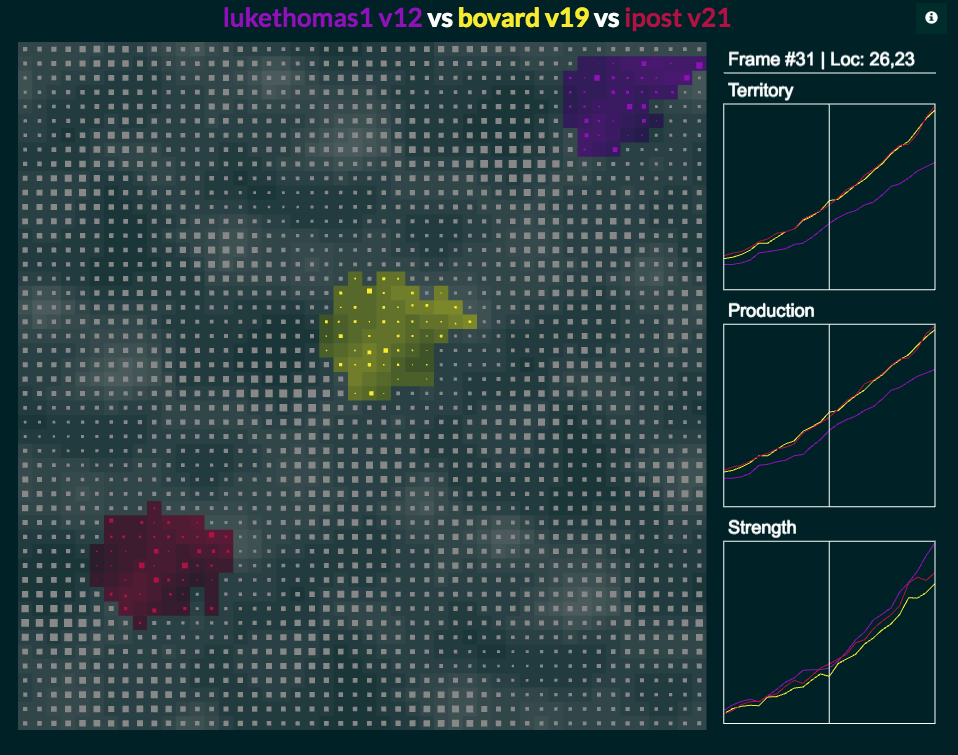
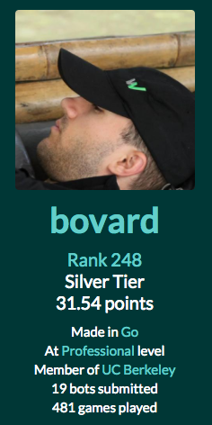

# halite_2016_go

My entry to the [halite.io](https://halite.io) AI programming competition. 

In Halite, you have to move your pieces to expand to take over neutral territory (and other players). Each square you control adds a specified number of pieces a turn. There can only be 255 pieces in a square.

My bot is pretty simple, each cell examines the area immediately around it and tries to make the best move.

After all the moves are queued up, I loop through them and remove any moves that would clobber (add up to more than 255 troops) and cancel them.

# Results
My entry ended up 248 out of 1592 which put me in the "Silver Tier".

